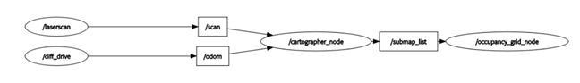

**English | [简体中文](README_cn.md)**
<div id="top"></div>


[![Contributors][contributors-shield]][contributors-url]
[![Forks][forks-shield]][forks-url]
[![Stargazers][stars-shield]][stars-url]
[![Issues][issues-shield]][issues-url]
[![License][license-shield]][license-url]


<!-- PROJECT LOGO -->
<br />
<div align="center">
    <a href="https://github.com/MoonGrt/Cruise_Robot">
    
    </a>
<h3 align="center">Cruise_Robot</h3>
    <p align="center">
    This project involves the development of a cruise robot based on the RT-Thread (Art-Pi) and ROS platforms, capable of real-time SLAM and autonomous navigation. The robot utilizes RT-Thread's multithreading to drive a LiDAR, odometer, and inertial module to gather current data, which is then processed using ROS's Cartographer for localization and map building, and Nav2 for path planning and obstacle avoidance. Additionally, the robot is equipped with the Yolo-Fastest model for real-time target detection, making it highly effective in identifying and tracking objects in its environment.
    <br />
    <a href="https://github.com/MoonGrt/Cruise_Robot"><strong>Explore the docs »</strong></a>
    <br />
    <a href="https://github.com/MoonGrt/Cruise_Robot">View Demo</a>
    ·
    <a href="https://github.com/MoonGrt/Cruise_Robot/issues">Report Bug</a>
    ·
    <a href="https://github.com/MoonGrt/Cruise_Robot/issues">Request Feature</a>
    </p>
</div>


<!-- CONTENTS -->
<details open>
  <summary>Contents</summary>
  <ol>
    <li><a href="#file-tree">File Tree</a></li>
    <li>
      <a href="#about-the-project">About The Project</a>
      <ul>
      </ul>
    </li>
    <li><a href="#contributing">Contributing</a></li>
    <li><a href="#license">License</a></li>
    <li><a href="#contact">Contact</a></li>
    <li><a href="#acknowledgments">Acknowledgments</a></li>
  </ol>
</details>


<!-- FILE TREE -->
## File Tree

```
└─ Project
  ├─ LICENSE
  ├─ README.md
  ├─ /Project/
  │ ├─ /applications/
  │ │ ├─ SConscript
  │ │ ├─ YDLIDAR.c
  │ │ ├─ ai.c
  │ │ ├─ camera.c
  │ │ ├─ dht11.c
  │ │ ├─ encoder.c
  │ │ ├─ ft6236.c
  │ │ ├─ main.c
  │ │ ├─ motor.c
  │ │ ├─ mpu6050.c
  │ │ ├─ onenet.c
  │ │ ├─ onenet_dht11.c
  │ │ ├─ ros_car.c
  │ │ ├─ ros_image.c
  │ │ ├─ ros_pub.c
  │ │ ├─ ros_subint.c
  │ │ ├─ rt_ai_person_yolo_model.c
  │ │ ├─ rt_ai_person_yolo_model.h
  │ │ ├─ sensor_dallas_dht11.c
  │ │ ├─ sensor_dallas_dht11.h
  │ │ ├─ timer.c
  │ │ ├─ yolo_layer.c
  │ │ ├─ yolo_layer.h
  │ │ └─ /web_dist/
  │ │   └─ /webnet/
  │ │     └─ index.html
  │ └─ /rt-thread/
  │   └─ /components/
  │     ├─ /cplusplus/
  │     ├─ /dfs/
  │     ├─ /drivers/
  │     ├─ /finsh/
  │     ├─ /libc/
  │     ├─ /lwp/
  │     ├─ /net/
  │     ├─ /utilities/
  │     ├─ /vbus/
  │     └─ /vmm/
  └─ /Document/

```


<!-- ABOUT THE PROJECT -->
## About The Project

<p style=" margin-top:0px; margin-bottom:0px; margin-left:0px; margin-right:0px; -qt-block-indent:0; text-indent:0px;"><span style=" font-family:'宋体'; font-size:14pt; font-weight:600;">Design Overview</span></p>
<p style=" margin-top:12px; margin-bottom:12px; margin-left:0px; margin-right:0px; -qt-block-indent:0; text-indent:0px;"><span style=" font-family:'Times New Roman','serif'; font-size:12pt;">1.1 Design Purpose</span> </p>
<p style=" margin-top:0px; margin-bottom:0px; margin-left:0px; margin-right:0px; -qt-block-indent:0; text-indent:0px;">According to the survey, the cleaning staff has limited energy and there are always stains and rubbish (dumped milk tea, drinks, etc.) that cannot be detected in time. At the same time, in the sanitation process, it is necessary to consume a lot of manpower to go back and forth to patrol and supervise to maintain environmental cleanliness. On the other hand, current sweeping robot algorithms are often designed to clean the full range, which makes the algorithm inefficient and difficult to quickly cover a wide range of areas. In order to solve the above problems and help cleaning staff to improve cleaning efficiency and save manpower and material costs, our team adopts real-time monitoring, image recognition, Internet of Things, ROS Nav navigation and other technologies, which can quickly identify and locate the stain blocks and rubbish clusters, and share them in real time through the network to the cleaning staff, who only need to clean a specific area. Using our design, the sanitation of large areas will require only a small number of personnel to maintain.</p>
<p style=" margin-top:12px; margin-bottom:12px; margin-left:0px; margin-right:0px; -qt-block-indent:0; text-indent:0px;"><span style=" font-family:'Times New Roman','serif'; font-size:12pt;">1.2 Application</span></p>
<p style=" margin-top:12px; margin-bottom:12px; margin-left:0px; margin-right:0px; -qt-block-indent:0; text-indent:0px;">For large public places such as hotels, schools, hospitals, office buildings, etc., such systems can detect stain blocks or rubbish clusters in the environment in real time through sensors and cameras, and orientate the deployment of cleaning personnel or equipment for cleaning, thus effectively saving resources and improving work efficiency. For home environments, the system can be used as an auxiliary to intelligent sweeping robots, which can not only complete the cleaning of all spaces, but also monitor the environment in real time, targeting only the areas with stains and rubbish for cleaning, improving cleaning efficiency and saving energy. At the same time, mobile robots with autonomous navigation and image transmission capabilities are also able to act as mobile surveillance or removal robots (courier robots).</p>
<p style=" margin-top:12px; margin-bottom:12px; margin-left:0px; margin-right:0px; -qt-block-indent:0; text-indent:0px;"><span style=" font-family:'Times New Roman','serif'; font-size:12pt;">1.3 Main technical features</span></p>
<p style=" margin-top:12px; margin-bottom:12px; margin-left:0px; margin-right:0px; -qt-block-indent:0; text-indent:0px;">Data upload is achieved by using the on-board AP6212 wifi &amp; bluetooth module. art-pi reads the imu module to get the robot's attitude, reads dht11 to get the ambient temperature and humidity data, and uploads the data to the onenet IoT platform via the mqtt protocol, which allows the data to be displayed in real time through the visualisation function.</p>
<p style=" margin-top:0px; margin-bottom:0px; margin-left:0px; margin-right:0px; -qt-block-indent:0; text-indent:0px;">The AI model utilises Yolo-Fastest, which has a model size of only 1.3MB, which enables Yolo-Fastest to run on resource-constrained devices. In addition, the computational complexity of Yolo-Fastest is also lower, with a FLOPS of only 0.23B, which means that Yolo-Fastest has a faster running speed. The Darknet framework is used to train and test, and after quantisation the darknet model is exported to the tflite model format, which is then deployed on Art-Pi.</p>
<p style=" margin-top:0px; margin-bottom:0px; margin-left:0px; margin-right:0px; -qt-block-indent:0; text-indent:0px;">The product is connected to ROS2 on an ubuntu host computer using micro-ros to upload the robot's odometry and environmental depth information to the ROS terminal. In ROS2, the robot is provided with real-time SLAM and autonomous navigation functions by using Cartographer, which is based on sensor data for localisation and map construction, and features global consistency optimisation and loopback detection, and Nav2, which supports path planning, obstacle avoidance, and multi-navigation modes, and can be flexibly configured and extended by integrating with ROS2. Configuration and expansion. With the combination of the two, the robot can build maps and achieve autonomous positioning and navigation in unknown environments, which is suitable for various application scenarios.</p>
<p style=" margin-top:12px; margin-bottom:12px; margin-left:0px; margin-right:0px; -qt-block-indent:0; text-indent:0px;"><span style=" font-family:'Times New Roman','serif'; font-size:12pt;">1.4 Key Performance Indicators</span></p>
<p style=" margin-top:12px; margin-bottom:12px; margin-left:0px; margin-right:0px; -qt-block-indent:0; text-indent:0px;">Using Cartographer and Nav2 in ROS2, the robot's localisation error was kept within ±5 cm in a set of test scenarios. 78% of the CPU resources were used.</p>
<p style=" margin-top:0px; margin-bottom:0px; margin-left:0px; margin-right:0px; -qt-block-indent:0; text-indent:0px;">The YDLIDAR X3 has a scanning frequency of 6±0.2Hz, a ranging frequency of 3000/Hz, an angular resolution of 0.96 (8Hz), and a relative error of 1%. the MPU6050‘s acceleration metric is set to ±2g, and its angular velocity metric is set to ±2,000. the Dht11’s humidity measurement range is from 20% to 90% RH, and its temperature measurement range is from 0 to +50°C. The humidity measurement accuracy is ±5.0%, and the temperature measurement accuracy is ±5.0%. The humidity measurement accuracy is ±5.0%RH, the temperature measurement accuracy is ±1.0℃, and the response time is &lt;5ms.</p>
<p style=" margin-top:12px; margin-bottom:12px; margin-left:0px; margin-right:0px; -qt-block-indent:0; text-indent:0px;">For the application of the Yolo-Fastest algorithm, here are some core parameters:</p>
<p style=" margin-top:0px; margin-bottom:0px; margin-left:0px; margin-right:0px; -qt-block-indent:0; text-indent:0px;">Model size: 1.3MB</p>
<p style=" margin-top:0px; margin-bottom:0px; margin-left:0px; margin-right:0px; -qt-block-indent:0; text-indent:0px;">Average precision: 61.02%</p>
<p style=" margin-top:0px; margin-bottom:0px; margin-left:0px; margin-right:0px; -qt-block-indent:0; text-indent:0px;">Number of floating point operations: 0.23B FLOPS</p>
<p style=" margin-top:0px; margin-bottom:0px; margin-left:0px; margin-right:0px; -qt-block-indent:0; text-indent:0px;">Yolo-Fastest. Flite Model Performance</p>
<p style=" margin-top:0px; margin-bottom:0px; margin-left:0px; margin-right:0px; -qt-block-indent:0; text-indent:0px;">Average precision: 48.26</p>
<p style=" margin-top:0px; margin-bottom:0px; margin-left:0px; margin-right:0px; -qt-block-indent:0; text-indent:0px;">Input size: 320x320x3</p>
<p style=" margin-top:0px; margin-bottom:0px; margin-left:0px; margin-right:0px; -qt-block-indent:0; text-indent:0px;">Floating Point Operations: 0.238</p>
<p style=" margin-top:0px; margin-bottom:0px; margin-left:0px; margin-right:0px; -qt-block-indent:0; text-indent:0px;">Model size: 1.17M</p>
<p style=" margin-top:12px; margin-bottom:12px; margin-left:0px; margin-right:0px; -qt-block-indent:0; text-indent:0px;"><span style=" font-family:'Times New Roman','serif'; font-size:12pt;">1.5 Key innovations</span></p>
<p style=" margin-top:12px; margin-bottom:12px; margin-left:0px; margin-right:0px; -qt-block-indent:0; text-indent:0px;">(1) ROS map building and navigation: real-time SLAM algorithm optimisation: the robot is able to build maps faster and more accurately in real-time scenarios and autonomous localisation with the help of rt-thread real-time operating system. Multi-sensor fusion, LiDAR and inertial measurement units are fused in to improve the accuracy and robustness of map building and positioning. Dynamic environment map building and navigation, the product can effectively handle dynamic environments, timely update maps and avoid obstacles. Autonomous path planning optimisation to generate smooth and safe paths more efficiently, avoiding collisions and excessive turns.</p>
<p style=" margin-top:0px; margin-bottom:0px; margin-left:0px; margin-right:0px; -qt-block-indent:0; text-indent:0px;">(2) Multi-threading: Through the use of RT-thread operating system, the MCU has the ability to handle multiple threads at the same time: sensor data acquisition, motion control, communication, user interface, etc. The use of RT-thread's thread management (scheduling, synchronisation, priority management, interrupt handling, etc.) enables the robot's various threads of each module to run harmoniously and efficiently, and makes better use of the MCU resources. MCU resources. At the same time, the thread priority management makes the product give priority to urgent threads and improves the real-time performance of the system.</p>
<p style="-qt-paragraph-type:empty; margin-top:0px; margin-bottom:0px; margin-left:0px; margin-right:0px; -qt-block-indent:0; text-indent:0px;"><br /></p>
<p style=" margin-top:0px; margin-bottom:0px; margin-left:0px; margin-right:0px; -qt-block-indent:0; text-indent:0px;">(3) Multi-interface: Provides rich interfaces and views to monitor and control the system operation: WeChat applet, web server, onenet IoT platform, ubuntu terminal and LCD screen display. WeChat applet gives users a convenient way to match the network through Bluetooth; meanwhile, wifi can reconnect automatically to simplify the networking process. The web server and onenet IoT platform are used to visualise the sensor data, the interface is simple and intuitive, and an interface is set up to allow the user to operate the robot remotely. ubuntu ROS terminal runs to configure the robot to build the map navigation system, displaying the image information transmitted by the robot. lcd displays the image data from the camera at this time, and at the same time, displays the data from the system's individual sensors.</p>
<p style="-qt-paragraph-type:empty; margin-top:0px; margin-bottom:0px; margin-left:0px; margin-right:0px; -qt-block-indent:0; text-indent:0px;"><br /></p>
<p style=" margin-top:0px; margin-bottom:0px; margin-left:0px; margin-right:0px; -qt-block-indent:0; text-indent:0px;">(4) Multi-functional: the product has a number of functions: ROS SLAM navigation, real-time recognition, remote monitoring, data upload. The product implements SLAM technology through ROS, which enables the robot to autonomously build maps in unknown environments and locate them at the same time, thus realising autonomous navigation functions. Meanwhile, the product is equipped with real-time image or object recognition function, which can quickly and accurately identify the target by using advanced computer vision algorithms. In addition, the product provides remote monitoring function, which allows users to view the robot's working status, camera screen and environmental information in real time through devices such as mobile phones, tablets or computers. Whether in smart homes, service robots, logistics and warehousing or other fields, such multifunctional products can help users achieve smarter, more efficient and convenient services and experiences.</p>
<p style="-qt-paragraph-type:empty; margin-top:12px; margin-bottom:12px; margin-left:0px; margin-right:0px; -qt-block-indent:0; text-indent:0px;"><br /></p>
<p style=" margin-top:12px; margin-bottom:12px; margin-left:0px; margin-right:0px; -qt-block-indent:0; text-indent:0px;"><span style=" font-family:'宋体'; font-size:14pt; font-weight:600;">System Composition and Functional Description</span></p>
<p style=" margin-top:12px; margin-bottom:12px; margin-left:0px; margin-right:0px; -qt-block-indent:0; text-indent:0px;"><span style=" font-family:'Times New Roman','serif'; font-size:12pt; font-weight:600;">2.1 Overview</span></p>
<p align="center" style=" margin-top:0px; margin-bottom:0px; margin-left:0px; margin-right:0px; -qt-block-indent:0; text-indent:0px;"></p>
<p align="center" style=" margin-top:0px; margin-bottom:0px; margin-left:0px; margin-right:0px; -qt-block-indent:0; text-indent:0px;"></p>
<p style="-qt-paragraph-type:empty; margin-top:0px; margin-bottom:0px; margin-left:0px; margin-right:0px; -qt-block-indent:0; text-indent:0px;"><br /></p>
<p style=" margin-top:0px; margin-bottom:0px; margin-left:0px; margin-right:0px; -qt-block-indent:0; text-indent:0px;"><span style=" font-family:'Times New Roman','serif'; font-size:12pt; font-weight:600;">ROS Part</span></p>
<p align="center" style=" margin-top:0px; margin-bottom:0px; margin-left:0px; margin-right:0px; -qt-block-indent:0; text-indent:0px;"></p>
<p style=" margin-top:0px; margin-bottom:0px; margin-left:0px; margin-right:0px; -qt-block-indent:0; text-indent:0px;"><span style=" font-family:'Times New Roman','serif'; font-size:12pt; font-weight:600;">AI Detect Part</span></p>
<p align="center" style=" margin-top:0px; margin-bottom:0px; margin-left:0px; margin-right:0px; -qt-block-indent:0; text-indent:0px;"></p>
<p style="-qt-paragraph-type:empty; margin-top:0px; margin-bottom:0px; margin-left:0px; margin-right:0px; -qt-block-indent:0; text-indent:0px;"><br /></p>
<p style=" margin-top:12px; margin-bottom:12px; margin-left:0px; margin-right:0px; -qt-block-indent:0; text-indent:0px;"><span style=" font-family:'Times New Roman','serif'; font-size:12pt; font-weight:600;">2.1 Modules</span></p>
<p style=" margin-top:12px; margin-bottom:12px; margin-left:0px; margin-right:0px; -qt-block-indent:0; text-indent:0px;">This project is divided into three main blocks: ROS, AI, and User Interface.</p>
<p style=" margin-top:12px; margin-bottom:12px; margin-left:0px; margin-right:0px; -qt-block-indent:0; text-indent:0px;"><span style=" font-family:'宋体'; font-size:12pt; font-weight:600;">ROS:</span></p>
<p style=" margin-top:12px; margin-bottom:12px; margin-left:0px; margin-right:0px; -qt-block-indent:0; text-indent:0px;">Mobile robot base: motion control, sensor data acquisition</p>
<p style=" margin-top:0px; margin-bottom:0px; margin-left:0px; margin-right:0px; -qt-block-indent:0; text-indent:0px;">AT8236: The AT8236 module is involved in controlling the motors on the base to enable the robot to achieve movement, steering and other actions.The AT8236 motor driver module is used to drive the motors on the base and is responsible for controlling the rotational speed and direction of the motors.The AT8236 controls the rotational speed of the motors by receiving the PWM (Optimised rt-thread kernel pwm driver source code) control signals, and according to the different signal control methods to achieve the robot's forward, backward, left turn, right turn and other movements. At the same time, AT8236 will read the pulse signals from the encoder to get the motor's rotational speed and direction information, and feedback the signals back to Art-pi to realise the closed-loop control of the motor.</p>
<p style="-qt-paragraph-type:empty; margin-top:0px; margin-bottom:0px; margin-left:0px; margin-right:0px; -qt-block-indent:0; text-indent:0px;"><br /></p>
<p style=" margin-top:0px; margin-bottom:0px; margin-left:0px; margin-right:0px; -qt-block-indent:0; text-indent:0px;">YDLIDAR X3 LIDAR: LIDAR is used to scan the surrounding environment and obtain the depth information of the surrounding environment, so as to draw a 2D map of the environment. With the LiDAR data, the robot can perform autonomous positioning and navigation, obstacle avoidance and other functions. The module is configured and initialised using UART according to the communication protocol of YDLIDAR X3. The data obtained is processed according to its datasheet to obtain the angle and the corresponding depth information, which is then filled into the sensor_msgs__msg__LaserScan message type in ros.</p>
<p style="-qt-paragraph-type:empty; margin-top:0px; margin-bottom:0px; margin-left:0px; margin-right:0px; -qt-block-indent:0; text-indent:0px;"><br /></p>
<p style=" margin-top:0px; margin-bottom:0px; margin-left:0px; margin-right:0px; -qt-block-indent:0; text-indent:0px;">mpu6050: Write a driver to read and parse the data from MPU6050 according to the MPU6050 communication protocol and register operation manual. Communicate with MPU6050 through I2C bus and data parsing function to convert the read raw data into physical quantities such as acceleration and angular velocity. Fill the calculated imu data into the sensor_msgs__msg__Imu message type in ros.</p>
<p style="-qt-paragraph-type:empty; margin-top:0px; margin-bottom:0px; margin-left:0px; margin-right:0px; -qt-block-indent:0; text-indent:0px;"><br /></p>
<p style=" margin-top:0px; margin-bottom:0px; margin-left:0px; margin-right:0px; -qt-block-indent:0; text-indent:0px;">DHT11: Set up a separate thread to read the data of temperature and humidity from DHT11. In the thread, first initialise the DHT11, including setting up the GPIO port and setting up the protocol for data transfer. Write the dht11 driver code to get the raw temperature and humidity data by calling the read function of DHT11.</p>
<p style="-qt-paragraph-type:empty; margin-top:0px; margin-bottom:0px; margin-left:0px; margin-right:0px; -qt-block-indent:0; text-indent:0px;"><br /></p>
<p style=" margin-top:0px; margin-bottom:0px; margin-left:0px; margin-right:0px; -qt-block-indent:0; text-indent:0px;">Ubuntu ROS terminal: modelling, mapping, navigation</p>
<p style=" margin-top:0px; margin-bottom:0px; margin-left:0px; margin-right:0px; -qt-block-indent:0; text-indent:0px;">URDF builds a cart model</p>
<p align="center" style=" margin-top:0px; margin-bottom:0px; margin-left:0px; margin-right:0px; -qt-block-indent:0; text-indent:0px;"></p>
<p style="-qt-paragraph-type:empty; margin-top:0px; margin-bottom:0px; margin-left:0px; margin-right:0px; -qt-block-indent:0; text-indent:0px;"><br /></p>
<p style=" margin-top:0px; margin-bottom:0px; margin-left:0px; margin-right:0px; -qt-block-indent:0; text-indent:0px;"><span style=" font-family:'宋体'; font-size:12pt;">Cartographer Mapping</span></p>
<p align="center" style=" margin-top:0px; margin-bottom:0px; margin-left:0px; margin-right:0px; -qt-block-indent:0; text-indent:0px;"></p>
<p style=" margin-top:0px; margin-bottom:0px; margin-left:0px; margin-right:0px; -qt-block-indent:0; text-indent:0px;">The /cartographer_node node receives data from the /scan and /odom topics for computation and outputs the /submap_list data. art-pi publishes the environmental depth information /scan from LIDAR as well as the robot pose information from imu via micro-ros. By calculating the information posted by Art-pi, Cartographer builds a map of the surrounding environment and provides it to the Nav2 module for robot movement navigation.</p>
<p style="-qt-paragraph-type:empty; margin-top:0px; margin-bottom:0px; margin-left:0px; margin-right:0px; -qt-block-indent:0; text-indent:0px;"><br /></p>
<p style=" margin-top:0px; margin-bottom:0px; margin-left:0px; margin-right:0px; -qt-block-indent:0; text-indent:0px;"><span style=" font-family:'宋体'; font-size:12pt;">Nav2 Navigation framework</span></p>
<p style=" margin-top:12px; margin-bottom:12px; margin-left:0px; margin-right:0px; -qt-block-indent:0; text-indent:0px;">Nav2 implements to move the mobile robot from point A to point B in a safe way.Nav2 applies robot navigation in which dynamic path planning, calculation of speed of motors, avoiding obstacles, and resuming the behaviour are done.Nav2 module publishes the information of type /cmd_vel twist subscribed by Art-pi and sends the velocity, angular velocity desire values of the mobile robot to Art -pi. after kinematic inverse solution of this data, it realises the required speed of the wheel given the linear and angular velocity.</p>
<p style=" margin-top:0px; margin-bottom:0px; margin-left:0px; margin-right:0px; -qt-block-indent:0; text-indent:0px;">Final ros rqt relation diagram</p>
<p align="center" style=" margin-top:0px; margin-bottom:0px; margin-left:0px; margin-right:0px; -qt-block-indent:0; text-indent:0px;"></p>
<p style=" margin-top:0px; margin-bottom:0px; margin-left:0px; margin-right:0px; -qt-block-indent:0; text-indent:0px;"><span style=" font-family:'宋体'; font-size:12pt; font-weight:600;">AI Part:</span> </p>
<p style=" margin-top:12px; margin-bottom:12px; margin-left:0px; margin-right:0px; -qt-block-indent:0; text-indent:0px;">Model Deployment: we make clever use of Darknet, an excellent neural network framework written in C and CUDA, which is specifically designed to enable the construction, training, and validation of the YOLO Fastest model.Darknet has the advantage of low latency and is one of the first frameworks to support the YOLO algorithm. After the model went through a fine-grained quantisation and pruning process, we successfully converted the model to Keras and TensorFlow Lite-compatible model formats, i.e., h5 and tflite. furthermore, with the power of the STM32 Cube AI and RT AK tools, we seamlessly deployed the model to RT Thread, a real-time operating system with scalable microkernel real-time operating system features in an open source embedded system, thus ensuring efficient performance and stability of the model in real-world operating environments.</p>
<p style=" margin-top:0px; margin-bottom:0px; margin-left:0px; margin-right:0px; -qt-block-indent:0; text-indent:0px;">Model inference: the decoding process of the YOLO model is precisely implemented. In the process of model inference, we calculated the confidence level of each detection result and set the appropriate threshold according to the project requirements. In order to obtain the optimal output results, we adopted the non-extremely large value suppression technique, which effectively eliminates duplicate and redundant detection frames and further improves the inference accuracy of the model. The input raw video stream is first greyscaled in RGB three-channel, followed by bilinear interpolation to convert the camera data into the input format required by the neural network model. After that, the rt_ai_find function finds the adapted AI model, and the rt_ai_init function configures the necessary parameters and initialises the found AI model. Finally, the rt_ai_run function performs model inference and outputs optimised images and accurate classification results, demonstrating the perfect combination of real-time computing and advanced visual processing capabilities.</p>
<p style="-qt-paragraph-type:empty; margin-top:12px; margin-bottom:12px; margin-left:0px; margin-right:0px; -qt-block-indent:0; text-indent:0px;"><br /></p>
<p style=" margin-top:12px; margin-bottom:12px; margin-left:0px; margin-right:0px; -qt-block-indent:0; text-indent:0px;"><span style=" font-family:'宋体'; font-size:12pt; font-weight:600;">User Interface</span></p>
<p style=" margin-top:12px; margin-bottom:12px; margin-left:0px; margin-right:0px; -qt-block-indent:0; text-indent:0px;">WeChat applets, web servers, onenet IoT platforms, ubuntu ROS terminals, and LCDs. </p>
<p style=" margin-top:12px; margin-bottom:12px; margin-left:0px; margin-right:0px; -qt-block-indent:0; text-indent:0px;"><span style=" font-family:'宋体'; font-size:12pt; font-weight:600;">WeChat applet: </span>(need to open the mobile phone wifi, bluetooth) users can through weibo scan code or search to enter the art-pi bluetooth network applet! The applet provides a convenient way for users to connect to the network through Bluetooth; at the same time, the use of fal and easyflash, the wifi data stored in the flash that will not be lost when the power is off, so that wifi can be automatically reconnected, and users only need to connect to the network once when they are using the product, which simplifies the process of users' networking.</p>
<p align="center" style=" margin-top:0px; margin-bottom:0px; margin-left:0px; margin-right:0px; -qt-block-indent:0; text-indent:0px;"></p>
<p style=" margin-top:0px; margin-bottom:0px; margin-left:0px; margin-right:0px; -qt-block-indent:0; text-indent:0px;"><span style=" font-family:'宋体'; font-size:12pt; font-weight:600;">Web Server: </span> After successful networking of the WeChat applet, you can visit our web page server in the browser of your mobile phone or computer The web page displays the product's memory usage, SD card capacity, network quality, etc. at this time. At the same time, the web page allows the user to exercise some control over the robot, realising the transfer of information and control commands between the user and the robot.</p>
<p align="center" style=" margin-top:0px; margin-bottom:0px; margin-left:0px; margin-right:0px; -qt-block-indent:0; text-indent:0px;"></p>
<p style=" margin-top:12px; margin-bottom:12px; margin-left:0px; margin-right:0px; -qt-block-indent:0; text-indent:0px;"><span style=" font-family:'宋体'; font-size:12pt; font-weight:600;">OneNet IoT Platform: </span><span style=" font-family:'宋体'; font-size:12pt;">Unlike a web server, the OneNet IoT platform is not limited to a local area network. The IoT platform allows you to connect to the robot's sensors and control modules, collect sensor data from the robot, and send commands to the robot via the IoT platform to remotely control it. After Art-pi connects to the network, it uses the mqtt protocol to upload all kinds of data, such as various sensor data, to the onenet cloud, and uses visualisation services to make all kinds of data clearer. And through onenet's API, subscribe to the data from the remote end.</span></p>
<p align="center" style=" margin-top:0px; margin-bottom:0px; margin-left:0px; margin-right:0px; -qt-block-indent:0; text-indent:0px;"></p>
<p style=" margin-top:12px; margin-bottom:12px; margin-left:0px; margin-right:0px; -qt-block-indent:0; text-indent:0px;"><span style=" font-family:'宋体'; font-size:12pt; font-weight:600;">Ubuntu Terminal: </span> The Ubuntu terminal is the control and management terminal for ROS robot mapping and navigation. The ROS cartographer package is used to map the robot's surroundings, and the Nav2 package is used to provide navigation services to the robot. On the ubuntu terminal, the robot cruise path can be configured. When the camera recognises the rubbish, it transmits the image data to ubuntu. ubuntu processes and displays the image information from Art-Pi by calling the cv2 library.</p>
<p align="center" style=" margin-top:0px; margin-bottom:0px; margin-left:0px; margin-right:0px; -qt-block-indent:0; text-indent:0px;"></p>
<p align="center" style=" margin-top:0px; margin-bottom:0px; margin-left:0px; margin-right:0px; -qt-block-indent:0; text-indent:0px;"></p>
<p align="center" style=" margin-top:0px; margin-bottom:0px; margin-left:0px; margin-right:0px; -qt-block-indent:0; text-indent:0px;"></p>
<p style=" margin-top:12px; margin-bottom:12px; margin-left:0px; margin-right:0px; -qt-block-indent:0; text-indent:0px;"><span style=" font-family:'宋体'; font-size:12pt; font-weight:600;">LCD: </span><span style=" font-family:'宋体'; font-size:12pt;">The spi LCD screen driven by ili9488 displays the image data transmitted back from the gc0328c camera at this time, and displays the data from each sensor of the system. At the same time, ft6236 driven touch screen, to achieve the system in the user's direct interaction. Through the LCD module, our products in the environment without network support, but also can display the various parameters of the system to the user, and at the same time can receive commands from the user, configuration.</span> </p>
<p align="center" style=" margin-top:0px; margin-bottom:0px; margin-left:0px; margin-right:0px; -qt-block-indent:0; text-indent:0px;"></p>
<p style=" margin-top:0px; margin-bottom:0px; margin-left:0px; margin-right:0px; -qt-block-indent:0; text-indent:0px;"><span style=" font-family:'宋体'; font-size:12pt; font-weight:600;">Filesystem &amp; usb-otg card reader</span></p>
<p style=" margin-top:12px; margin-bottom:12px; margin-left:0px; margin-right:0px; -qt-block-indent:0; text-indent:0px;">A virtual file system is built on Art-pi, which can operate the files in SD card and flash by commands such as ls, cd, cp, etc. When the AI recognises the rubbish and dirt, the system will save the image data to the SD card. Users can read the dirt photos through card reader or OTG port for secondary confirmation.</p>
<p align="center" style=" margin-top:0px; margin-bottom:0px; margin-left:0px; margin-right:0px; -qt-block-indent:0; text-indent:0px;"></p>
<p style="-qt-paragraph-type:empty; margin-top:0px; margin-bottom:0px; margin-left:0px; margin-right:0px; -qt-block-indent:0; text-indent:0px;"><br /></p>
<p style=" margin-top:12px; margin-bottom:12px; margin-left:0px; margin-right:0px; -qt-block-indent:0; text-indent:0px;"><span style=" font-family:'宋体'; font-size:14pt; font-weight:600;">Performance Parameters</span></p>
<p style=" margin-top:12px; margin-bottom:12px; margin-left:0px; margin-right:0px; -qt-block-indent:0; text-indent:0px;">Multi-terminal user interface of all kinds of functions are basically realised, including WeChat applet, web server, onenet IoT platform, ubuntu ROS terminal and LCD display. The product can be operated through the LCD screen without network, and the robot system can be accessed through the web server in the LAN and the onenet IoT platform in the external network. The comprehensive multi-terminal user interface enables users to have a richer, more convenient and flexible experience and service when using the robot.</p>
<p style=" margin-top:0px; margin-bottom:0px; margin-left:0px; margin-right:0px; -qt-block-indent:0; text-indent:0px;">In using ROS, for slam building, the coordinate error is within ±5cm and the delay is around 38ms, which can be further improved. At the same time, the data read by the imu module of the robot was not filtered, after which Kalman filtering was added, etc. Meanwhile, the product uses UDP to transmit data to the ubuntu host computer, which is unreliable when transmitting large volume data such as LiDAR depth packets or transmitting data such as images. Due to the large amount of data, the possibility of packet loss increases. In addition, UDP does not guarantee the order of arrival of packets during transmission, which may lead to confusion in the packet order.</p>
<p style=" margin-top:0px; margin-bottom:0px; margin-left:0px; margin-right:0px; -qt-block-indent:0; text-indent:0px;">By using Yolo-Fastest. the Flite model has an average accuracy of 61.02% and the number of floating point operations is 0.23B FLOPS.</p></body></html>
<p align="right">(<a href="#top">top</a>)</p>


<!-- CONTRIBUTING -->
## Contributing

Contributions are what make the open source community such an amazing place to learn, inspire, and create. Any contributions you make are **greatly appreciated**.
If you have a suggestion that would make this better, please fork the repo and create a pull request. You can also simply open an issue with the tag "enhancement".
Don't forget to give the project a star! Thanks again!
1. Fork the Project
2. Create your Feature Branch (`git checkout -b feature/AmazingFeature`)
3. Commit your Changes (`git commit -m 'Add some AmazingFeature'`)
4. Push to the Branch (`git push origin feature/AmazingFeature`)
5. Open a Pull Request
<p align="right">(<a href="#top">top</a>)</p>


<!-- LICENSE -->
## License

Distributed under the MIT License. See `LICENSE` for more information.
<p align="right">(<a href="#top">top</a>)</p>


<!-- CONTACT -->
## Contact

MoonGrt - 1561145394@qq.com
Project Link: [MoonGrt/](https://github.com/MoonGrt/)
<p align="right">(<a href="#top">top</a>)</p>


<!-- ACKNOWLEDGMENTS -->
## Acknowledgments

* [Choose an Open Source License](https://choosealicense.com)
* [GitHub Emoji Cheat Sheet](https://www.webpagefx.com/tools/emoji-cheat-sheet)
* [Malven's Flexbox Cheatsheet](https://flexbox.malven.co/)
* [Malven's Grid Cheatsheet](https://grid.malven.co/)
* [Img Shields](https://shields.io)
* [GitHub Pages](https://pages.github.com)
* [Font Awesome](https://fontawesome.com)
* [React Icons](https://react-icons.github.io/react-icons/search)
<p align="right">(<a href="#top">top</a>)</p>


<!-- MARKDOWN LINKS & IMAGES -->
<!-- https://www.markdownguide.org/basic-syntax/#reference-style-links -->
[contributors-shield]: https://img.shields.io/github/contributors/MoonGrt/Cruise_Robot.svg?style=for-the-badge
[contributors-url]: https://github.com/MoonGrt/Cruise_Robot/graphs/contributors
[forks-shield]: https://img.shields.io/github/forks/MoonGrt/Cruise_Robot.svg?style=for-the-badge
[forks-url]: https://github.com/MoonGrt/Cruise_Robot/network/members
[stars-shield]: https://img.shields.io/github/stars/MoonGrt/Cruise_Robot.svg?style=for-the-badge
[stars-url]: https://github.com/MoonGrt/Cruise_Robot/stargazers
[issues-shield]: https://img.shields.io/github/issues/MoonGrt/Cruise_Robot.svg?style=for-the-badge
[issues-url]: https://github.com/MoonGrt/Cruise_Robot/issues
[license-shield]: https://img.shields.io/github/license/MoonGrt/Cruise_Robot.svg?style=for-the-badge
[license-url]: https://github.com/MoonGrt/Cruise_Robot/blob/master/LICENSE

