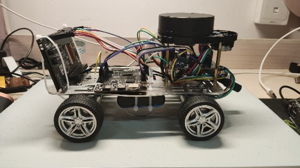
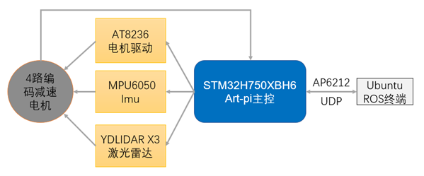
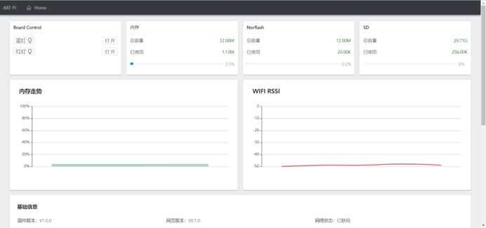
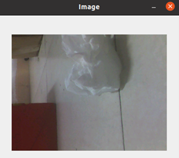
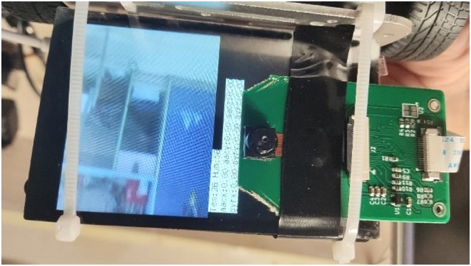
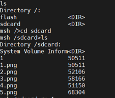

**简体中文 | [English](README.md)**
<div id="top"></div>

[![Contributors][contributors-shield]][contributors-url]
[![Forks][forks-shield]][forks-url]
[![Stargazers][stars-shield]][stars-url]
[![Issues][issues-shield]][issues-url]
[![License][license-shield]][license-url]


<!-- PROJECT LOGO -->
<br />
<div align="center">
    <a href="https://github.com/MoonGrt/Cruise_Robot">
    
    </a>
<h3 align="center">Cruise_Robot</h3>
    <p align="center">
    本项目通过实时监测和图像识别技术，提升公共场所和家庭的清洁效率，快速定位污渍和垃圾，智能调配清洁资源。结合AP6212模块和Yolo-Fastest算法，系统实现自主导航和高精度定位，适用于酒店、学校、医院等场所，有效节约人力和物力成本。
    <br />
    <a href="https://github.com/MoonGrt/Cruise_Robot"><strong>浏览文档 »</strong></a>
    <br />
    <a href="https://github.com/MoonGrt/Cruise_Robot">查看 Demo</a>
    ·
    <a href="https://github.com/MoonGrt/Cruise_Robot/issues">反馈 Bug</a>
    ·
    <a href="https://github.com/MoonGrt/Cruise_Robot/issues">请求新功能</a>
    </p>
</div>


<!-- CONTENTS -->
<details open>
  <summary>目录</summary>
  <ol>
    <li><a href="#文件树">文件树</a></li>
    <li>
      <a href="#关于本项目">关于本项目</a>
      <ul>
      </ul>
    </li>
    <li><a href="#贡献">贡献</a></li>
    <li><a href="#许可证">许可证</a></li>
    <li><a href="#联系我们">联系我们</a></li>
    <li><a href="#致谢">致谢</a></li>
  </ol>
</details>


<!-- 文件树 -->
## 文件树

```
└─ Project
  ├─ LICENSE
  ├─ README.md
  ├─ /Project/
  │ ├─ /applications/
  │ │ ├─ SConscript
  │ │ ├─ YDLIDAR.c
  │ │ ├─ ai.c
  │ │ ├─ camera.c
  │ │ ├─ dht11.c
  │ │ ├─ encoder.c
  │ │ ├─ ft6236.c
  │ │ ├─ main.c
  │ │ ├─ motor.c
  │ │ ├─ mpu6050.c
  │ │ ├─ onenet.c
  │ │ ├─ onenet_dht11.c
  │ │ ├─ ros_car.c
  │ │ ├─ ros_image.c
  │ │ ├─ ros_pub.c
  │ │ ├─ ros_subint.c
  │ │ ├─ rt_ai_person_yolo_model.c
  │ │ ├─ rt_ai_person_yolo_model.h
  │ │ ├─ sensor_dallas_dht11.c
  │ │ ├─ sensor_dallas_dht11.h
  │ │ ├─ timer.c
  │ │ ├─ yolo_layer.c
  │ │ ├─ yolo_layer.h
  │ │ └─ /web_dist/
  │ │   └─ /webnet/
  │ │     └─ index.html
  │ └─ /rt-thread/
  │   └─ /components/
  │     ├─ /cplusplus/
  │     ├─ /dfs/
  │     ├─ /drivers/
  │     ├─ /finsh/
  │     ├─ /libc/
  │     ├─ /lwp/
  │     ├─ /net/
  │     ├─ /utilities/
  │     ├─ /vbus/
  │     └─ /vmm/
  └─ /Document/

```


<!-- 关于本项目 -->
## 关于本项目

<p style=" margin-top:12px; margin-bottom:12px; margin-left:0px; margin-right:0px; -qt-block-indent:0; text-indent:0px;"><span style=" font-family:'宋体'; font-size:14pt; font-weight:600;">第一部分</span><span style=" font-family:'Times New Roman','serif'; font-size:14pt; font-weight:600;">  </span><span style=" font-family:'宋体'; font-size:12pt; font-weight:600;">设计概述</span> </p>
<p style=" margin-top:12px; margin-bottom:12px; margin-left:0px; margin-right:0px; -qt-block-indent:0; text-indent:0px;"><span style=" font-family:'Times New Roman','serif'; font-size:12pt;">1.1</span><span style=" font-family:'Times New Roman'; font-size:7pt;">    </span><span style=" font-family:'宋体'; font-size:12pt;">设计目的</span> </p>
<p style=" margin-top:0px; margin-bottom:0px; margin-left:0px; margin-right:0px; -qt-block-indent:0; text-indent:0px;"><span style=" font-family:'宋体'; font-size:12pt;">根据调查发现，清洁人员精力有限，总有不能及时发现的污渍、垃圾（倾倒的奶茶、饮料等）。同时在环卫过程中，需要消耗大量的人力去来回巡逻监管来维持环境清洁。另一方面，当前的扫地机器人算法设计往往是全范围打扫，这样的算法效率低下，难以快速覆盖大范围区域。为解决以上问题，帮助清洁人员提高清洁效率、节省人力物力成本，我们团队采用实时监测、图像识别、物联网、</span><span style=" font-family:'Times New Roman','serif'; font-size:12pt;">ROS Nav</span><span style=" font-family:'宋体'; font-size:12pt;">导航等技术，能迅速识别定位污渍块，垃圾团，并通过网络实时共享给清洁人员，清洁人员只需要对特定的区域进行清扫。运用我们的设计，大片区域的环卫就只需要少量人员来维持。</span> </p>
<p style=" margin-top:12px; margin-bottom:12px; margin-left:0px; margin-right:0px; -qt-block-indent:0; text-indent:0px;"><span style=" font-family:'Times New Roman','serif'; font-size:12pt;">1.2</span><span style=" font-family:'Times New Roman'; font-size:7pt;">    </span><span style=" font-family:'宋体'; font-size:12pt;">应用领域</span> </p>
<p style=" margin-top:12px; margin-bottom:12px; margin-left:0px; margin-right:0px; -qt-block-indent:0; text-indent:0px;"><span style=" font-family:'宋体'; font-size:12pt;">对于酒店、学校、医院、办公楼等大型公共场所，这种系统可以通过感应器、摄像头实时检测环境中的污渍块或垃圾团，并定向调配清洁人员或设备进行清洁，从而有效节省资源并提高工作效率。对于家庭环境，系统可以作为智能扫地机器人的辅助，不仅可以完成所有空间的打扫，更能对环境进行实时监控，只针对有污渍和垃圾的区域进行清洁，提高清洁效率，节约能源。同时，拥有自主导航和图像传输功能的移动机器人，也能够作为移动监控或移物机器人（快递机器人）。</span> </p>
<p style=" margin-top:12px; margin-bottom:12px; margin-left:0px; margin-right:0px; -qt-block-indent:0; text-indent:0px;"><span style=" font-family:'Times New Roman','serif'; font-size:12pt;">1.3</span><span style=" font-family:'Times New Roman'; font-size:7pt;">    </span><span style=" font-family:'宋体'; font-size:12pt;">主要技术特点</span> </p>
<p style=" margin-top:12px; margin-bottom:12px; margin-left:0px; margin-right:0px; -qt-block-indent:0; text-indent:0px;"><span style=" font-family:'宋体'; font-size:12pt;">利用板载的</span><span style=" font-family:'Times New Roman','serif'; font-size:12pt;">AP6212 wifi&amp;</span><span style=" font-family:'宋体'; font-size:12pt;">蓝牙模块实现数据上传。</span><span style=" font-family:'Times New Roman','serif'; font-size:12pt;">Art-pi</span><span style=" font-family:'宋体'; font-size:12pt;">读取</span><span style=" font-family:'Times New Roman','serif'; font-size:12pt;">imu</span><span style=" font-family:'宋体'; font-size:12pt;">模块得到机器人的姿态，读取</span><span style=" font-family:'Times New Roman','serif'; font-size:12pt;">dht11</span><span style=" font-family:'宋体'; font-size:12pt;">获得环境温湿度数据，并将数据通过</span><span style=" font-family:'Times New Roman','serif'; font-size:12pt;">mqtt</span><span style=" font-family:'宋体'; font-size:12pt;">协议上传到</span><span style=" font-family:'Times New Roman','serif'; font-size:12pt;">onenet</span><span style=" font-family:'宋体'; font-size:12pt;">物联网平台，通过可视化功能使数据可以实时显示。</span> </p>
<p style=" margin-top:12px; margin-bottom:12px; margin-left:0px; margin-right:0px; -qt-block-indent:0; text-indent:0px;"><span style=" font-family:'Times New Roman','serif'; font-size:12pt;">AI</span><span style=" font-family:'宋体'; font-size:12pt;">模型运用</span><span style=" font-family:'Times New Roman','serif'; font-size:12pt;">Yolo-Fastest</span><span style=" font-family:'宋体'; font-size:12pt;">，其模型大小仅为</span><span style=" font-family:'Times New Roman','serif'; font-size:12pt;">1.3MB</span><span style=" font-family:'宋体'; font-size:12pt;">，这使得</span><span style=" font-family:'Times New Roman','serif'; font-size:12pt;">Yolo-Fastest</span><span style=" font-family:'宋体'; font-size:12pt;">能够在资源受限的设备上运行。此外，</span><span style=" font-family:'Times New Roman','serif'; font-size:12pt;">Yolo-Fastest</span><span style=" font-family:'宋体'; font-size:12pt;">的计算复杂度也较低，其</span><span style=" font-family:'Times New Roman','serif'; font-size:12pt;">FLOPS</span><span style=" font-family:'宋体'; font-size:12pt;">仅为</span><span style=" font-family:'Times New Roman','serif'; font-size:12pt;">0.23B</span><span style=" font-family:'宋体'; font-size:12pt;">，这意味着</span><span style=" font-family:'Times New Roman','serif'; font-size:12pt;">Yolo-Fastest</span><span style=" font-family:'宋体'; font-size:12pt;">拥有更快的运行速度。运用</span><span style=" font-family:'Times New Roman','serif'; font-size:12pt;">Darknet</span><span style=" font-family:'宋体'; font-size:12pt;">框架训练并测试，经过量化后</span><span style=" font-family:'Times New Roman','serif'; font-size:12pt;">darknet</span><span style=" font-family:'宋体'; font-size:12pt;">模型输出为</span><span style=" font-family:'Times New Roman','serif'; font-size:12pt;">tflite</span><span style=" font-family:'宋体'; font-size:12pt;">模型格式，再部署在</span><span style=" font-family:'Times New Roman','serif'; font-size:12pt;">Art-pi</span><span style=" font-family:'宋体'; font-size:12pt;">上。</span> </p>
<p style=" margin-top:12px; margin-bottom:12px; margin-left:0px; margin-right:0px; -qt-block-indent:0; text-indent:0px;"><span style=" font-family:'宋体'; font-size:12pt;">产品使用</span><span style=" font-family:'Times New Roman','serif'; font-size:12pt;">micro-ros</span><span style=" font-family:'宋体'; font-size:12pt;">与</span><span style=" font-family:'Times New Roman','serif'; font-size:12pt;">ubuntu</span><span style=" font-family:'宋体'; font-size:12pt;">上位机上的</span><span style=" font-family:'Times New Roman','serif'; font-size:12pt;">ROS2</span><span style=" font-family:'宋体'; font-size:12pt;">进行连接，将机器人里程计以及环境深度信息上传</span><span style=" font-family:'Times New Roman','serif'; font-size:12pt;">ROS</span><span style=" font-family:'宋体'; font-size:12pt;">终端。在</span><span style=" font-family:'Times New Roman','serif'; font-size:12pt;">ROS2 </span><span style=" font-family:'宋体'; font-size:12pt;">里通过使用</span><span style=" font-family:'Times New Roman','serif'; font-size:12pt;">Cartographer</span><span style=" font-family:'宋体'; font-size:12pt;">和</span><span style=" font-family:'Times New Roman','serif'; font-size:12pt;">Nav2</span><span style=" font-family:'宋体'; font-size:12pt;">为机器人提供了实时</span><span style=" font-family:'Times New Roman','serif'; font-size:12pt;">SLAM</span><span style=" font-family:'宋体'; font-size:12pt;">和自主导航的功能。</span><span style=" font-family:'Times New Roman','serif'; font-size:12pt;">Cartographer</span><span style=" font-family:'宋体'; font-size:12pt;">基于传感器数据进行定位和地图构建，具有全局一致性优化和回环检测等特点。</span><span style=" font-family:'Times New Roman','serif'; font-size:12pt;">Nav2</span><span style=" font-family:'宋体'; font-size:12pt;">支持路径规划、障碍物避障和多导航模式，与</span><span style=" font-family:'Times New Roman','serif'; font-size:12pt;">ROS2</span><span style=" font-family:'宋体'; font-size:12pt;">集成，可灵活配置和扩展。两者结合使用，机器人能在未知环境中构建地图、实现自主定位和导航，适用于各种应用场景。</span> </p>
<p style=" margin-top:12px; margin-bottom:12px; margin-left:0px; margin-right:0px; -qt-block-indent:0; text-indent:0px;"><span style=" font-family:'Times New Roman','serif'; font-size:12pt;">1.4</span><span style=" font-family:'Times New Roman'; font-size:7pt;">    </span><span style=" font-family:'宋体'; font-size:12pt;">关键性能指标</span> </p>
<p style=" margin-top:12px; margin-bottom:12px; margin-left:0px; margin-right:0px; -qt-block-indent:0; text-indent:0px;"><span style=" font-family:'宋体'; font-size:12pt;">在</span><span style=" font-family:'Times New Roman','serif'; font-size:12pt;">ROS2 </span><span style=" font-family:'宋体'; font-size:12pt;">里通过使用</span><span style=" font-family:'Times New Roman','serif'; font-size:12pt;">Cartographer</span><span style=" font-family:'宋体'; font-size:12pt;">和</span><span style=" font-family:'Times New Roman','serif'; font-size:12pt;">Nav2</span><span style=" font-family:'宋体'; font-size:12pt;">，在一组测试场景中，机器人的定位误差保持在±</span><span style=" font-family:'Times New Roman','serif'; font-size:12pt;">5</span><span style=" font-family:'宋体'; font-size:12pt;">厘米内。</span><span style=" font-family:'Times New Roman','serif'; font-size:12pt;">CPU</span><span style=" font-family:'宋体'; font-size:12pt;">资源占用</span><span style=" font-family:'Times New Roman','serif'; font-size:12pt;">78%</span><span style=" font-family:'宋体'; font-size:12pt;">。</span> </p>
<p style=" margin-top:12px; margin-bottom:12px; margin-left:0px; margin-right:0px; -qt-block-indent:0; text-indent:0px;"><span style=" font-family:'宋体'; font-size:12pt;">YDLIDAR </span><span style=" font-family:'Times New Roman','serif'; font-size:12pt;">X3</span><span style=" font-family:'宋体'; font-size:12pt;">扫描频率为</span><span style=" font-family:'Times New Roman','serif'; font-size:12pt;">6±0.2Hz</span><span style=" font-family:'宋体'; font-size:12pt;">，测距频率</span><span style=" font-family:'Times New Roman','serif'; font-size:12pt;">3000 / Hz</span><span style=" font-family:'宋体'; font-size:12pt;">，角度分辨率</span><span style=" font-family:'Times New Roman','serif'; font-size:12pt;">0.96</span><span style=" font-family:'宋体'; font-size:12pt;">（</span><span style=" font-family:'Times New Roman','serif'; font-size:12pt;">8Hz</span><span style=" font-family:'宋体'; font-size:12pt;">），相对误差</span><span style=" font-family:'Times New Roman','serif'; font-size:12pt;">1%</span><span style=" font-family:'宋体'; font-size:12pt;">。</span><span style=" font-family:'Times New Roman','serif'; font-size:12pt;">MPU6050</span><span style=" font-family:'宋体'; font-size:12pt;">的加速度度量范围设置为</span><span style=" font-family:'Times New Roman','serif'; font-size:12pt;">±2g</span><span style=" font-family:'宋体'; font-size:12pt;">，角速度度量范围设置为</span><span style=" font-family:'Times New Roman','serif'; font-size:12pt;">±2000</span><span style=" font-family:'宋体'; font-size:12pt;">。</span><span style=" font-family:'Times New Roman','serif'; font-size:12pt;">Dht11</span><span style=" font-family:'宋体'; font-size:12pt;">湿度测量范围为</span><span style=" font-family:'Times New Roman','serif'; font-size:12pt;">20%</span><span style=" font-family:'宋体'; font-size:12pt;">～</span><span style=" font-family:'Times New Roman','serif'; font-size:12pt;">90%RH</span><span style=" font-family:'宋体'; font-size:12pt;">，温度测量范围为</span><span style=" font-family:'Times New Roman','serif'; font-size:12pt;">0</span><span style=" font-family:'宋体'; font-size:12pt;">～</span><span style=" font-family:'Times New Roman','serif'; font-size:12pt;">+50℃</span><span style=" font-family:'宋体'; font-size:12pt;">，湿度测量精度为±</span><span style=" font-family:'Times New Roman','serif'; font-size:12pt;">5.0%RH</span><span style=" font-family:'宋体'; font-size:12pt;">，温度测量精度为±</span><span style=" font-family:'Times New Roman','serif'; font-size:12pt;">1.0℃</span><span style=" font-family:'宋体'; font-size:12pt;">，响应时间</span><span style=" font-family:'Times New Roman','serif'; font-size:12pt;">&lt;5ms</span><span style=" font-family:'宋体'; font-size:12pt;">。</span> </p>
<p style=" margin-top:12px; margin-bottom:12px; margin-left:0px; margin-right:0px; -qt-block-indent:0; text-indent:0px;"><span style=" font-family:'宋体'; font-size:12pt;">对于</span><span style=" font-family:'Times New Roman','serif'; font-size:12pt;">Yolo-Fastest</span><span style=" font-family:'宋体'; font-size:12pt;">算法的应用，以下是一些核心参数：</span> </p>
<p style=" margin-top:12px; margin-bottom:12px; margin-left:0px; margin-right:0px; -qt-block-indent:0; text-indent:0px;"><span style=" font-family:'宋体'; font-size:12pt;">模型大小：</span><span style=" font-family:'Times New Roman','serif'; font-size:12pt;">1.3MB</span> </p>
<p style=" margin-top:12px; margin-bottom:12px; margin-left:0px; margin-right:0px; -qt-block-indent:0; text-indent:0px;"><span style=" font-family:'宋体'; font-size:12pt;">平均精度：</span><span style=" font-family:'Times New Roman','serif'; font-size:12pt;">61.02%</span> </p>
<p style=" margin-top:12px; margin-bottom:12px; margin-left:0px; margin-right:0px; -qt-block-indent:0; text-indent:0px;"><span style=" font-family:'宋体'; font-size:12pt;">浮点运算次数：</span><span style=" font-family:'Times New Roman','serif'; font-size:12pt;">0.23B FLOPS</span> </p>
<p style=" margin-top:12px; margin-bottom:12px; margin-left:0px; margin-right:0px; -qt-block-indent:0; text-indent:0px;"><span style=" font-family:'Times New Roman','serif'; font-size:12pt;">Yolo-Fastest. Flite</span><span style=" font-family:'宋体'; font-size:12pt;">模型性能表现</span> </p>
<p style=" margin-top:12px; margin-bottom:12px; margin-left:0px; margin-right:0px; -qt-block-indent:0; text-indent:0px;"><span style=" font-family:'宋体'; font-size:12pt;">平均精度：</span><span style=" font-family:'Times New Roman','serif'; font-size:12pt;">48.26</span> </p>
<p style=" margin-top:12px; margin-bottom:12px; margin-left:0px; margin-right:0px; -qt-block-indent:0; text-indent:0px;"><span style=" font-family:'宋体'; font-size:12pt;">输入尺寸：</span><span style=" font-family:'Times New Roman','serif'; font-size:12pt;">320x320x3</span> </p>
<p style=" margin-top:12px; margin-bottom:12px; margin-left:0px; margin-right:0px; -qt-block-indent:0; text-indent:0px;"><span style=" font-family:'宋体'; font-size:12pt;">浮点运算次数：</span><span style=" font-family:'Times New Roman','serif'; font-size:12pt;">0.238</span> </p>
<p style=" margin-top:12px; margin-bottom:12px; margin-left:0px; margin-right:0px; -qt-block-indent:0; text-indent:0px;"><span style=" font-family:'宋体'; font-size:12pt;">模型大小：</span><span style=" font-family:'Times New Roman','serif'; font-size:12pt;">1.17M</span> </p>
<p style=" margin-top:12px; margin-bottom:12px; margin-left:0px; margin-right:0px; -qt-block-indent:0; text-indent:0px;"><span style=" font-family:'Times New Roman','serif'; font-size:12pt;">1.5</span><span style=" font-family:'Times New Roman'; font-size:7pt;">    </span><span style=" font-family:'宋体'; font-size:12pt;">主要创新点</span> </p>
<p style=" margin-top:12px; margin-bottom:12px; margin-left:0px; margin-right:0px; -qt-block-indent:0; text-indent:0px;"><span style=" font-family:'宋体'; font-size:12pt;">（1）ROS建图导航：实时SLAM算法优化：机器人在rt-thread实时操作系统的帮助下能够在实时场景下更快速、更准确地构建地图并进行自主定位。多传感器融合，激光雷达与惯性测量单元融合进来，提高地图构建和定位的精度和鲁棒性。动态环境建图与导航，产品能有效处理动态环境，及时更新地图和避免障碍物。自主路径规划优化，更高效地生成平滑且安全的路径，避免碰撞和过度转弯。</span> </p>
<p style=" margin-top:12px; margin-bottom:12px; margin-left:0px; margin-right:0px; -qt-block-indent:0; text-indent:0px;"><span style=" font-family:'宋体'; font-size:12pt;">（2）多线程：通过使用RT-thread操作系统，让MCU拥有能同时处理多个线程的能力：传感器数据采集、运动控制、通信、用户界面等。rt-thread的线程管理（调度、同步、优先级管理、中断处理等）的运用，使得机器人各模块各线程能够和谐高效运行，更充分地利用MCU资源。同时，线程的优先级管理使得产品优先进行紧急的线程，提高系统的实时性。</span> </p>
<p style=" margin-top:12px; margin-bottom:12px; margin-left:0px; margin-right:0px; -qt-block-indent:0; text-indent:0px;"><span style=" font-family:'宋体'; font-size:12pt;">（3）多界面：提供丰富的接口和视图来监控和控制系统的运行：微信小程序，网页服务器，onenet物联网平台、ubuntu终端以及LCD屏幕显示。微信小程序通过蓝牙给用户提供一个便利的方式来配网；同时，wifi能自动重连，简化了联网过程。网页服务器和onenet物联网平台用来可视化传感器数据，界面简洁直观，并设置接口允许用户远程操作机器人。ubuntu ROS终端运行配置机器人建图导航系统，显示机器人传来的图像信息。LCD显示此时摄像头的图像数据，同时显示系统各个传感器数据。</span> </p>
<p style=" margin-top:12px; margin-bottom:12px; margin-left:0px; margin-right:0px; -qt-block-indent:0; text-indent:0px;"><span style=" font-family:'宋体'; font-size:12pt;">（4）多功能：产品有多项功能：ROS SLAM建图导航、实时识别、远程监控、数据上传等。产品通过ROS实现了SLAM技术，使机器人能够在未知环境中自主构建地图，并同时进行定位，从而实现自主导航功能。同时产品配备了实时图像或物体识别功能，利用先进的计算机视觉算法，可以快速、准确地识别目标。另外，产品提供远程监控功能，用户可以通过手机、平板电脑或计算机等设备，实时查看机器人的工作状态、摄像头画面以及环境信息。无论是在智能家居、服务机器人、物流仓储还是其他领域，这样的多功能产品可以帮助用户实现更智能、高效、便捷的服务和体验。</span> </p>
<p style="-qt-paragraph-type:empty; margin-top:12px; margin-bottom:12px; margin-left:0px; margin-right:0px; -qt-block-indent:0; text-indent:0px;"><br /></p>
<p style=" margin-top:12px; margin-bottom:12px; margin-left:0px; margin-right:0px; -qt-block-indent:0; text-indent:0px;"><span style=" font-family:'宋体'; font-size:14pt; font-weight:600;">第二部分</span><span style=" font-family:'Times New Roman','serif'; font-size:14pt; font-weight:600;">  </span><span style=" font-family:'宋体'; font-size:12pt; font-weight:600;">系统组成及功能说明</span> </p>
<p style=" margin-top:12px; margin-bottom:12px; margin-left:0px; margin-right:0px; -qt-block-indent:0; text-indent:0px;"><span style=" font-family:'Times New Roman','serif'; font-size:12pt; font-weight:600;">2.1</span><span style=" font-family:'Times New Roman'; font-size:7pt;">    </span><span style=" font-family:'宋体'; font-size:12pt; font-weight:600;">整体介绍</span> </p>
<p align="center" style=" margin-top:0px; margin-bottom:0px; margin-left:0px; margin-right:0px; -qt-block-indent:0; text-indent:0px;"></p>
<p align="center" style=" margin-top:0px; margin-bottom:0px; margin-left:0px; margin-right:0px; -qt-block-indent:0; text-indent:0px;"></p>
<p style="-qt-paragraph-type:empty; margin-top:0px; margin-bottom:0px; margin-left:0px; margin-right:0px; -qt-block-indent:0; text-indent:0px;"><br /></p>
<p style=" margin-top:0px; margin-bottom:0px; margin-left:0px; margin-right:0px; -qt-block-indent:0; text-indent:0px;"><span style=" font-family:'Times New Roman','serif'; font-size:12pt; font-weight:600;">ROS</span><span style=" font-family:'宋体'; font-size:12pt; font-weight:600;">部分</span> </p>
<p align="center" style=" margin-top:0px; margin-bottom:0px; margin-left:0px; margin-right:0px; -qt-block-indent:0; text-indent:0px;"></p>
<p style=" margin-top:0px; margin-bottom:0px; margin-left:0px; margin-right:0px; -qt-block-indent:0; text-indent:0px;"><span style=" font-family:'Times New Roman','serif'; font-size:12pt; font-weight:600;">AI</span><span style=" font-family:'宋体'; font-size:12pt; font-weight:600;">识别部分</span> </p>
<p align="center" style=" margin-top:0px; margin-bottom:0px; margin-left:0px; margin-right:0px; -qt-block-indent:0; text-indent:0px;"></p>
<p style="-qt-paragraph-type:empty; margin-top:0px; margin-bottom:0px; margin-left:0px; margin-right:0px; -qt-block-indent:0; text-indent:0px;"><br /></p>
<p style=" margin-top:12px; margin-bottom:12px; margin-left:0px; margin-right:0px; -qt-block-indent:0; text-indent:0px;"><span style=" font-family:'Times New Roman','serif'; font-size:12pt; font-weight:600;">2.1</span><span style=" font-family:'Times New Roman'; font-size:7pt;">    </span><span style=" font-family:'宋体'; font-size:12pt; font-weight:600;">各模块介绍</span> </p>
<p style=" margin-top:12px; margin-bottom:12px; margin-left:0px; margin-right:0px; -qt-block-indent:0; text-indent:0px;"><span style=" font-family:'宋体'; font-size:12pt;">本设计主要分为三大块：ROS，AI，用户界面。</span> </p>
<p style=" margin-top:12px; margin-bottom:12px; margin-left:0px; margin-right:0px; -qt-block-indent:0; text-indent:0px;"><span style=" font-family:'宋体'; font-size:12pt; font-weight:600;">ROS部分：</span></p>
<p style=" margin-top:12px; margin-bottom:12px; margin-left:0px; margin-right:0px; -qt-block-indent:0; text-indent:0px;"><span style=" font-family:'宋体'; font-size:12pt;">移动机器人底座：运动控制、传感器数据采集</span> </p>
<p style=" margin-top:12px; margin-bottom:12px; margin-left:0px; margin-right:0px; -qt-block-indent:0; text-indent:0px;"><span style=" font-family:'宋体'; font-size:12pt;">AT8236：AT8236模块涉及控制底座上的电机，使机器人能够实现运动、转向等动作。AT8236电机驱动模块用来驱动底座上的电机，负责控制电机的转速和方向。AT8236通过接收PWM（优化rt-thread内核pwm驱动源码）控制信号来控制电机的转速，并根据不同的信号控制方式实现机器人的前进、后退、左转、右转等运动。同时，AT8236将通过读取编码器的脉冲信号来获取电机的转速和方向信息，并将信号反馈回Art-pi，实现电机的闭环控制。</span> </p>
<p style=" margin-top:12px; margin-bottom:12px; margin-left:0px; margin-right:0px; -qt-block-indent:0; text-indent:0px;"><span style=" font-family:'宋体'; font-size:12pt;">YDLIDAR X3激光雷达：激光雷达用于扫描周围环境并获取周围环境深度信息，从而绘制出环境的二维地图。通过激光雷达数据，机器人可以进行自主定位和导航，避障等功能。根据YDLIDAR X3的通信协议，使用UART对该模块进行配置和初始化。根据其数据手册对获得的数据进行处理从而获得角度以及对应的深度信息，再填入ros中的sensor_msgs__msg__LaserScan消息类型中。</span> </p>
<p style=" margin-top:12px; margin-bottom:12px; margin-left:0px; margin-right:0px; -qt-block-indent:0; text-indent:0px;"><span style=" font-family:'宋体'; font-size:12pt;">mpu6050：根据MPU6050的通信协议和寄存器操作手册，编写驱动程序以读取和解析MPU6050的数据。通过I2C总线与MPU6050进行通信，以及数据解析函数，将读取的原始数据转换为加速度和角速度等物理量。将计算得到的imu数据填入ros中的sensor_msgs__msg__Imu消息类型中。</span> </p>
<p style=" margin-top:12px; margin-bottom:12px; margin-left:0px; margin-right:0px; -qt-block-indent:0; text-indent:0px;"><span style=" font-family:'宋体'; font-size:12pt;">DHT11：设置一个独立线程，读取DHT11传回的温湿度的数据。在线程中，首先初始化DHT11，包括设置GPIO口和设置数据传输的协议。编写dht11驱动代码，通过调用DHT11的读取函数，获取原始温湿度数据，并对其进行处理，将原始数据转换为温度和湿度的数据。</span> </p>
<p style=" margin-top:12px; margin-bottom:12px; margin-left:0px; margin-right:0px; -qt-block-indent:0; text-indent:0px;"><span style=" font-family:'宋体'; font-size:12pt;">Ubuntu ROS终端：建模，建图，导航</span> </p>
<p style=" margin-top:12px; margin-bottom:12px; margin-left:0px; margin-right:0px; -qt-block-indent:0; text-indent:0px;"><span style=" font-family:'宋体'; font-size:12pt;">URDF建立小车模型</span> </p>
<p align="center" style=" margin-top:0px; margin-bottom:0px; margin-left:0px; margin-right:0px; -qt-block-indent:0; text-indent:0px;"></p>
<p style="-qt-paragraph-type:empty; margin-top:0px; margin-bottom:0px; margin-left:0px; margin-right:0px; -qt-block-indent:0; text-indent:0px;"><br /></p>
<p style=" margin-top:0px; margin-bottom:0px; margin-left:0px; margin-right:0px; -qt-block-indent:0; text-indent:0px;"><span style=" font-family:'宋体'; font-size:12pt;">Cartographer建图</span></p>
<p align="center" style=" margin-top:0px; margin-bottom:0px; margin-left:0px; margin-right:0px; -qt-block-indent:0; text-indent:0px;"></p>
<p style=" margin-top:0px; margin-bottom:0px; margin-left:0px; margin-right:0px; -qt-block-indent:0; text-indent:0px;"><span style=" font-family:'宋体'; font-size:12pt;">/cartographer_node节点从/scan和/odom话题接收数据进行计算，输出/submap_list数据。Art-pi通过micro-ros发布激光雷达的环境深度信息/scan以及imu的机器人姿态信息。通过计算Art-pi发布来的信息，Cartographer建立周围环境地图，并提供给Nav2模块进行机器人的移动导航。</span> </p>
<p style="-qt-paragraph-type:empty; margin-top:0px; margin-bottom:0px; margin-left:0px; margin-right:0px; -qt-block-indent:0; text-indent:0px;"><br /></p>
<p style=" margin-top:0px; margin-bottom:0px; margin-left:0px; margin-right:0px; -qt-block-indent:0; text-indent:0px;"><span style=" font-family:'宋体'; font-size:12pt;">Nav2导航框架</span> </p>
<p style=" margin-top:12px; margin-bottom:12px; margin-left:0px; margin-right:0px; -qt-block-indent:0; text-indent:0px;"><span style=" font-family:'宋体'; font-size:12pt;">Nav2实现以安全的方式让移动机器人从A点移动到B点。Nav2应用机器人导航，在这个过程中需要完成动态路径规划、计算电机的速度、避免障碍、恢复行为。Nav2模块发布Art-pi订阅的/cmd_vel twist类型信息，将移动机器人的速度、角速度欲值发送给Art-pi。经过对此数据的运动学逆解，实现给定线速度和角速度，计算出轮子所需转速。</span> </p>
<p style=" margin-top:12px; margin-bottom:12px; margin-left:0px; margin-right:0px; -qt-block-indent:0; text-indent:0px;"><span style=" font-family:'宋体'; font-size:12pt;">最终ros rqt关系图</span></p>
<p align="center" style=" margin-top:0px; margin-bottom:0px; margin-left:0px; margin-right:0px; -qt-block-indent:0; text-indent:0px;"></p>
<p style=" margin-top:0px; margin-bottom:0px; margin-left:0px; margin-right:0px; -qt-block-indent:0; text-indent:0px;"><span style=" font-family:'宋体'; font-size:12pt; font-weight:600;">AI部分</span> </p>
<p style=" margin-top:12px; margin-bottom:12px; margin-left:0px; margin-right:0px; -qt-block-indent:0; text-indent:0px;"><span style=" font-family:'宋体'; font-size:12pt;">模型部署：我们巧妙地运用Darknet，这是一款用C和CUDA编写的优秀神经网络框架，专门用于实现YOLO Fastest模型的构建、训练以及验证。Darknet拥有低延迟的优势，同时是首批支持YOLO算法的框架之一。在模型经历了精细的量化和剪枝过程之后，我们成功地将模型转换为Keras和TensorFlow Lite兼容的模型格式，即h5和tflite。进一步地，借助于STM32 Cube AI和RT AK工具的强大功能，我们将模型无缝地部署到RT Thread，一个具有可伸缩微内核实时操作系统特性的开源嵌入式系统，从而确保了模型在实际运行环境中的高效性能和稳定性。</span> </p>
<p style=" margin-top:12px; margin-bottom:12px; margin-left:0px; margin-right:0px; -qt-block-indent:0; text-indent:0px;"><span style=" font-family:'宋体'; font-size:12pt;">模型推理：精确地实现了YOLO模型的解码流程。在模型推理的过程中，我们计算了各个检测结果的置信度，并根据项目需求设定了适宜的阈值。为了得到最优的输出结果，我们采用了非极大值抑制技术，有效地消除了重复和冗余的检测框，进一步提升了模型的推理准确度。输入的原始视频流首先经过RGB三通道灰度化处理，随后进行双线性插值将摄像头数据转换为神经网络模型所需的输入格式。之后，rt_ai_find函数查找适配的AI模型，rt_ai_init函数对找到的AI模型进行必要的参数配置以及初始化。最后，rt_ai_run函数执行模型推理，输出优化后的图片以及精确的分类结果，展现了实时计算和高级视觉处理能力的完美结合。</span> </p>
<p style="-qt-paragraph-type:empty; margin-top:12px; margin-bottom:12px; margin-left:0px; margin-right:0px; -qt-block-indent:0; text-indent:0px;"><br /></p>
<p style=" margin-top:12px; margin-bottom:12px; margin-left:0px; margin-right:0px; -qt-block-indent:0; text-indent:0px;"><span style=" font-family:'宋体'; font-size:12pt; font-weight:600;">用户界面部分</span> </p>
<p style=" margin-top:12px; margin-bottom:12px; margin-left:0px; margin-right:0px; -qt-block-indent:0; text-indent:0px;"><span style=" font-family:'宋体'; font-size:12pt;">微信小程序，网页服务器，onenet物联网平台，ubuntu ROS终端以及LCD。</span> </p>
<p style=" margin-top:12px; margin-bottom:12px; margin-left:0px; margin-right:0px; -qt-block-indent:0; text-indent:0px;"><span style=" font-family:'宋体'; font-size:12pt; font-weight:600;">微信小程序</span><span style=" font-family:'宋体'; font-size:12pt;">：（需打开手机wifi、蓝牙）用户可以通过微信扫码或搜索进入Art-pi蓝牙配网小程序。该小程序通过蓝牙给用户提供一个便利的方式来配网；同时fal以及easyflash的运用，将wifi数据储存在掉电不丢失的flash中，使得wifi能自动重连，用户使用产品时只需要配网一次，简化了用户联网过程。</span> </p>
<p align="center" style=" margin-top:0px; margin-bottom:0px; margin-left:0px; margin-right:0px; -qt-block-indent:0; text-indent:0px;"></p>
<p style=" margin-top:0px; margin-bottom:0px; margin-left:0px; margin-right:0px; -qt-block-indent:0; text-indent:0px;"><span style=" font-family:'宋体'; font-size:12pt; font-weight:600;">网页服务器</span><span style=" font-family:'宋体'; font-size:12pt;">：微信小程序联网成功后，可在手机或电脑的浏览器访问我们的web网页服务器。在该网页中显示产品此时内存占用、SD卡容量、网络质量等信息。同时，该web网页允许用户对机器人进行一定的控制，实现了用户与机器人之间的信息传递和控制指令的转发。</span> </p>
<p align="center" style=" margin-top:0px; margin-bottom:0px; margin-left:0px; margin-right:0px; -qt-block-indent:0; text-indent:0px;"></p>
<p style=" margin-top:12px; margin-bottom:12px; margin-left:0px; margin-right:0px; -qt-block-indent:0; text-indent:0px;"><span style=" font-family:'宋体'; font-size:12pt; font-weight:600;">OneNet物联网平台</span><span style=" font-family:'宋体'; font-size:12pt;">：与web网页服务器不同，OneNet物联网平台并不局限于局域网。通过该物联网平台可以连接机器人的传感器和控制模块，收集机器人的传感器数据，同时也可以通过物联网平台发送指令给机器人，实现远程控制。在Art-pi连接网络后，运用mqtt协议将各类数据，如各种传感器数据，上传到onenet云端，并使用可视化服务，使各类数据更加清晰。并通过onenet的API订阅来自远端的。</span></p>
<p align="center" style=" margin-top:0px; margin-bottom:0px; margin-left:0px; margin-right:0px; -qt-block-indent:0; text-indent:0px;"></p>
<p style=" margin-top:12px; margin-bottom:12px; margin-left:0px; margin-right:0px; -qt-block-indent:0; text-indent:0px;"><span style=" font-family:'宋体'; font-size:12pt; font-weight:600;">Ubuntu终端</span><span style=" font-family:'宋体'; font-size:12pt;">：Ubuntu终端是ROS机器人建图导航的控制和管理终端。通过ROS的cartographer功能包对机器人周围环境的建图、Nav2功能包给机器人提供导航服务。在ubuntu终端上，可以配置机器人巡航路径。当摄像头识别到垃圾时，它会将图像数据传送到ubuntu。ubuntu通过调用cv2库对Art-pi传来的图片信息进行处理和显示。</span> </p>
<p align="center" style=" margin-top:0px; margin-bottom:0px; margin-left:0px; margin-right:0px; -qt-block-indent:0; text-indent:0px;"></p>
<p align="center" style=" margin-top:0px; margin-bottom:0px; margin-left:0px; margin-right:0px; -qt-block-indent:0; text-indent:0px;"></p>
<p align="center" style=" margin-top:0px; margin-bottom:0px; margin-left:0px; margin-right:0px; -qt-block-indent:0; text-indent:0px;"></p>
<p style=" margin-top:12px; margin-bottom:12px; margin-left:0px; margin-right:0px; -qt-block-indent:0; text-indent:0px;"><span style=" font-family:'宋体'; font-size:12pt; font-weight:600;">LCD：</span><span style=" font-family:'宋体'; font-size:12pt;">ili9488驱动的spi LCD屏幕上显示此时gc0328c摄像头传回的图像数据，并显示系统各个传感器数据。同时，ft6236驱动的触摸屏，实现系统于用户的直接交互。通过LCD模块，我们的产品在没有网络支持的环境中，也能将系统的各个参数显示给用户，同时能接收来自用户的命令、配置。</span> </p>
<p align="center" style=" margin-top:0px; margin-bottom:0px; margin-left:0px; margin-right:0px; -qt-block-indent:0; text-indent:0px;"></p>
<p style=" margin-top:0px; margin-bottom:0px; margin-left:0px; margin-right:0px; -qt-block-indent:0; text-indent:0px;"><span style=" font-family:'宋体'; font-size:12pt; font-weight:600;">文件系统 &amp; usb-otg读卡器</span> </p>
<p style=" margin-top:12px; margin-bottom:12px; margin-left:0px; margin-right:0px; -qt-block-indent:0; text-indent:0px;"><span style=" font-family:'宋体'; font-size:12pt;">在Art-pi上搭建了虚拟文件系统，可以通过ls、cd、cp等命令对SD卡、flash中的文件进行操作。当AI识别到垃圾污物，系统将会把图像数据保存到SD卡中。用户可以通过读卡器或者OTG接口读取污物照片来进行二次确认。</span> </p>
<p align="center" style=" margin-top:0px; margin-bottom:0px; margin-left:0px; margin-right:0px; -qt-block-indent:0; text-indent:0px;"></p>
<p style="-qt-paragraph-type:empty; margin-top:0px; margin-bottom:0px; margin-left:0px; margin-right:0px; -qt-block-indent:0; text-indent:0px;"><br /></p>
<p style=" margin-top:12px; margin-bottom:12px; margin-left:0px; margin-right:0px; -qt-block-indent:0; text-indent:0px;"><span style=" font-family:'宋体'; font-size:14pt; font-weight:600;">第三部分</span><span style=" font-family:'Times New Roman','serif'; font-size:14pt; font-weight:600;">  </span><span style=" font-family:'宋体'; font-size:12pt; font-weight:600;">性能参数</span> </p>
<p style=" margin-top:12px; margin-bottom:12px; margin-left:0px; margin-right:0px; -qt-block-indent:0; text-indent:0px;"><span style=" font-family:'宋体'; font-size:12pt;">多终端用户操作界面的各类功能基本实现，包括微信小程序，网页服务器，onenet物联网平台，ubuntu ROS终端以及LCD显示。没有网络可以通过LCD屏幕对产品进行操作，局域网内可以通过web网页服务器，外网能够通过onenet物联网平台接入机器人系统。全面的多终端用户操作界面使得用户在使用机器人时能够获得更加丰富、便捷、灵活的体验和服务。</span> </p>
<p style=" margin-top:12px; margin-bottom:12px; margin-left:0px; margin-right:0px; -qt-block-indent:0; text-indent:0px;"><span style=" font-family:'宋体'; font-size:12pt;">在使用</span><span style=" font-family:'Times New Roman','serif'; font-size:12pt;">ROS</span><span style=" font-family:'宋体'; font-size:12pt;">，进行</span><span style=" font-family:'Times New Roman','serif'; font-size:12pt;">slam</span><span style=" font-family:'宋体'; font-size:12pt;">建图，坐标误差在±</span><span style=" font-family:'Times New Roman','serif'; font-size:12pt;">5cm</span><span style=" font-family:'宋体'; font-size:12pt;">内，延时在</span><span style=" font-family:'Times New Roman','serif'; font-size:12pt;">38ms</span><span style=" font-family:'宋体'; font-size:12pt;">左右，可以进一步改进。同时机器人的</span><span style=" font-family:'Times New Roman','serif'; font-size:12pt;">imu</span><span style=" font-family:'宋体'; font-size:12pt;">模块读取的数据没有进行滤波处理，之后添加卡尔曼滤波等。同时，产品使用</span><span style=" font-family:'Times New Roman','serif'; font-size:12pt;">UDP</span><span style=" font-family:'宋体'; font-size:12pt;">向</span><span style=" font-family:'Times New Roman','serif'; font-size:12pt;">ubuntu </span><span style=" font-family:'宋体'; font-size:12pt;">上位机传输数据，在传输大容量数据如激光雷达深度数据包或传输图像等数据时，</span><span style=" font-family:'Times New Roman','serif'; font-size:12pt;">UDP</span><span style=" font-family:'宋体'; font-size:12pt;">传输数据不可靠。由于数据量较大，丢包的可能性增加。另外，</span><span style=" font-family:'Times New Roman','serif'; font-size:12pt;">UDP</span><span style=" font-family:'宋体'; font-size:12pt;">在传输过程中，数据包的到达顺序不受保证，可能导致数据包顺序混乱。</span> </p>
<p style=" margin-top:12px; margin-bottom:12px; margin-left:0px; margin-right:0px; -qt-block-indent:0; text-indent:0px;"><span style=" font-family:'宋体'; font-size:12pt;">通过使用</span><span style=" font-family:'Times New Roman','serif'; font-size:12pt;">Yolo-Fastest. Flite</span><span style=" font-family:'宋体'; font-size:12pt;">模型，其平均精度为</span><span style=" font-family:'Times New Roman','serif'; font-size:12pt;">61.02%</span><span style=" font-family:'宋体'; font-size:12pt;">，浮点运算次数为</span><span style=" font-family:'Times New Roman','serif'; font-size:12pt;">0.23B FLOPS</span><span style=" font-family:'宋体'; font-size:12pt;">。</span> </p></body></html>
<p align="right">(<a href="#top">top</a>)</p>


<!-- 贡献 -->
## 贡献

贡献让开源社区成为了一个非常适合学习、互相激励和创新的地方。你所做出的任何贡献都是**受人尊敬**的。

如果你有好的建议，请复刻（fork）本仓库并且创建一个拉取请求（pull request）。你也可以简单地创建一个议题（issue），并且添加标签「enhancement」。不要忘记给项目点一个 star！再次感谢！

1. 复刻（Fork）本项目
2. 创建你的 Feature 分支 (`git checkout -b feature/AmazingFeature`)
3. 提交你的变更 (`git commit -m 'Add some AmazingFeature'`)
4. 推送到该分支 (`git push origin feature/AmazingFeature`)
5. 创建一个拉取请求（Pull Request）
<p align="right">(<a href="#top">top</a>)</p>


<!-- 许可证 -->
## 许可证

根据 MIT 许可证分发。打开 [LICENSE](LICENSE) 查看更多内容。
<p align="right">(<a href="#top">top</a>)</p>


<!-- 联系我们 -->
## 联系我们

MoonGrt - 1561145394@qq.com
Project Link: [MoonGrt/Cruise_Robot](https://github.com/MoonGrt/Cruise_Robot)

<p align="right">(<a href="#top">top</a>)</p>


<!-- 致谢 -->
## 致谢

* [Choose an Open Source License](https://choosealicense.com)
* [GitHub Emoji Cheat Sheet](https://www.webpagefx.com/tools/emoji-cheat-sheet)
* [Malven's Flexbox Cheatsheet](https://flexbox.malven.co/)
* [Malven's Grid Cheatsheet](https://grid.malven.co/)
* [Img Shields](https://shields.io)
* [GitHub Pages](https://pages.github.com)
* [Font Awesome](https://fontawesome.com)
* [React Icons](https://react-icons.github.io/react-icons/search)
<p align="right">(<a href="#top">top</a>)</p>


<!-- MARKDOWN LINKS & IMAGES -->
<!-- https://www.markdownguide.org/basic-syntax/#reference-style-links -->
[contributors-shield]: https://img.shields.io/github/contributors/MoonGrt/Cruise_Robot.svg?style=for-the-badge
[contributors-url]: https://github.com/MoonGrt/Cruise_Robot/graphs/contributors
[forks-shield]: https://img.shields.io/github/forks/MoonGrt/Cruise_Robot.svg?style=for-the-badge
[forks-url]: https://github.com/MoonGrt/Cruise_Robot/network/members
[stars-shield]: https://img.shields.io/github/stars/MoonGrt/Cruise_Robot.svg?style=for-the-badge
[stars-url]: https://github.com/MoonGrt/Cruise_Robot/stargazers
[issues-shield]: https://img.shields.io/github/issues/MoonGrt/Cruise_Robot.svg?style=for-the-badge
[issues-url]: https://github.com/MoonGrt/Cruise_Robot/issues
[license-shield]: https://img.shields.io/github/license/MoonGrt/Cruise_Robot.svg?style=for-the-badge
[license-url]: https://github.com/MoonGrt/Cruise_Robot/blob/master/LICENSE

